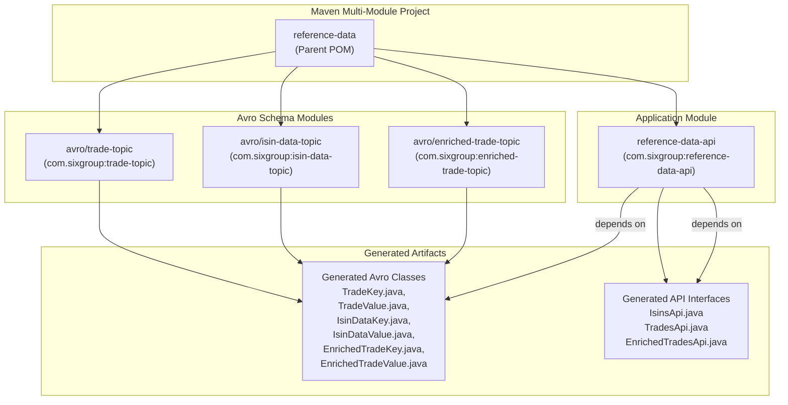
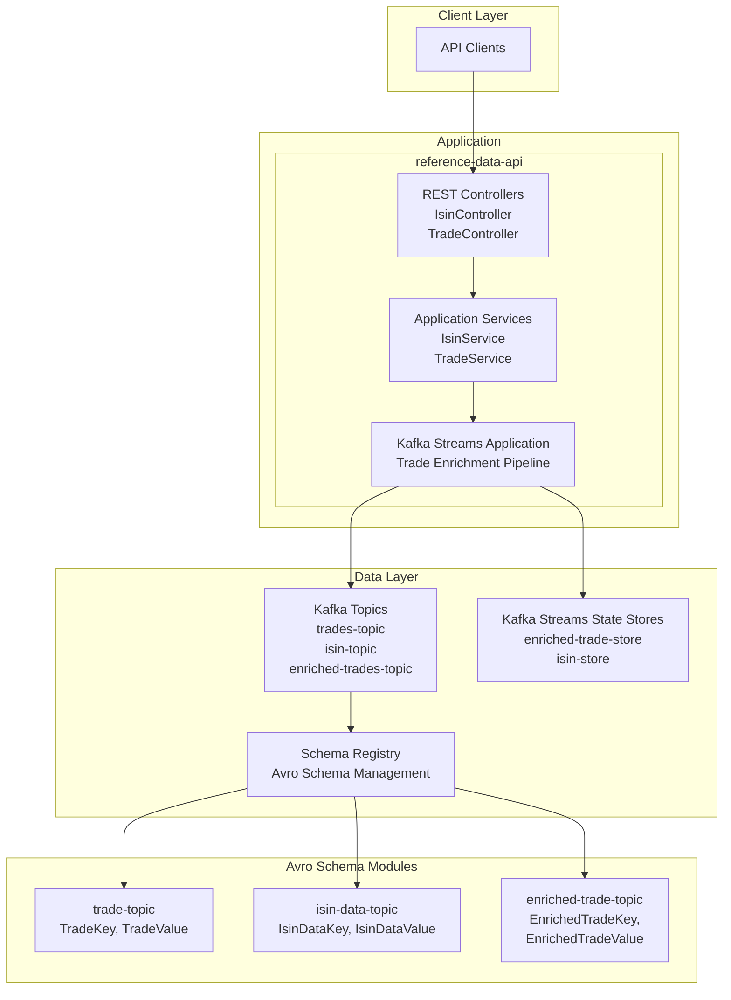

# Reference Data Management System

This is a sample Spring Boot application project for managing reference data, including trades and ISIN (International Securities Identification
Number) information, with Kafka integration for real-time data processing.

We've added a REST API with Swagger UI to create ISINs and trades, which are stored in Kafka topics.
When we create a trade for an existing ISIN, it's automatically enriched using Kafka Streams.
With Swagger UI you can also get details from Kafka of an ISIN or paginated list of ISINs or trades.     
Trades are retrieved using a custom consumer, which reads data from a specific offset using `seek()`. This consumer supports multiple partitions;
however, as mentioned, this implementation is only for demonstration purposes. In a production environment, you should manage offsets carefully to
ensure consumption starts at the correct position for each partition.

## Project Overview

This is a multi-module Maven project containing **reference-data-api** and the Avro schemas for **ISINs**, **trades**, and **enriched trades**.



## Project Structure

```
reference-data/
├── avro/                          # A folder containing modules that define the Avro schemas for the data of the three Kafka topics.
│   ├── trade-topic/               # Avro schema module defining TradeKey and TradeValue records for raw trade data. 
│   ├── isin-data-topic/           # Avro schema module defining IsinDataKey and IsinDataValue records for securities reference data.
│   └── enriched-trade-topic/      # Avro schema module defining EnrichedTradeKey and EnrichedTradeValue records that combine trade data with ISIN reference data.
├── reference-data-api/            # Main Spring Boot application module that implements the REST API and Kafka Streams processing logic.
├── configuration/                 # Contains cross-module configuration files, such  Eclipse formatter settings for consistent code style across the project.
├── scripts/                       # Directory containing utility scripts, such as those for creating topics
└── docker-compose.yml             # Defines the development environment with Kafka broker, Schema Registry, Kafka UI, and topic initialization services.
└── pom.xml                        # Parent Maven POM that orchestrates the multi-module build, defines shared dependencies.
```

## Architecture

The application follows a microservices architecture with:

- **REST API**: Spring Boot application exposing endpoints for trades and ISIN management.
- **Kafka Integration**: Real-time data streaming and processing.
- **Avro Serialization**: Schema evolution support for data contracts.



## Technology Stack

- **Java 21**
- **Spring Boot 3.5.5**
- **Apache Kafka** with Confluent Platform
- **Apache Avro** for schema management
- **Maven** for build management
- **Docker Compose** for local development environment

Claro, aquí tienes el contenido de la imagen en formato Markdown.

## Technology Stack

The platform is built using modern Java technologies with a focus on type safety and real-tine processing capabilities.

| Component         | Technology                      | Purpose                                        |
|-------------------|---------------------------------|------------------------------------------------|
| Runtime           | Java 21                         | Core runtime environment                       |
| Framework         | Spring Boot 3.5.5               | Application framework and dependency injection |
| Event Processing  | Apache Kafka Streams            | Real-time data stream processing               |
| Serialization     | Apache Avro 1.12.0              | Schema-first data serialization                |
| Schema Management | Confluent Schema Registry 8.0.0 | Avro schema versioning and compatibility       |
| API Documentation | OpenAPI 3.0 / Swagger           | Contract-first API design                      |
| Code Generation   | MapStruct 1.6.3                 | Type-safe object mapping                       |
| Build System      | Maven 3                         | Multi-module build and dependency management   |
| Testing           | Testcontainers                  | Integration testing with real Kafka instances  |
| Code Quality      | ArchUnit                        | Hexagonal architecture validation              |
| Code Quality      | Spotless                        | Code formatting                                |
| Deployment        | Docker Compose                  | For local development environment              |

## API Endpoints

The application provides the following REST endpoints:

### Trade Management

- `POST /api/trades` - Create a new trade
- `GET /api/trades` - Get trades with pagination
- `GET /api/enriched-trades/{tradeRef}` - Get enriched trade by reference

### ISIN Management

- `POST /api/isins` - Create a new ISIN
- `GET /api/isins` - Get ISINs with pagination
- `GET /api/isins/{isin}` - Get specific ISIN information

## Kafka Topics

The system uses three main Kafka topics:

- `trades-topic` - Trade data
- `isin-topic` - ISIN reference data
- `enriched-trades-topic` - Trades enriched with ISIN data

## Getting Started

### Prerequisites

- Java 21
- Docker and Docker Compose
- Maven 3.6+

### Local Development Setup

1. **Start the infrastructure services**:
   ```bash
   docker-compose up -d
   ```

   This will start:
    - Kafka broker (port 9092)
    - Schema Registry (port 8081)
    - Kafka UI (port 8989)

2. **Build the application**:
   ```bash
   ./mvnw clean install
   ```

3. **Run the application**:
   ```bash
   ./mvnw spring-boot:run -pl reference-data-api
   ```

The application will be available at `http://localhost:8080`

### API Documentation

Once the application is running, you can access:

- **Swagger UI**: `http://localhost:8080/swagger-ui.html`
- **OpenAPI Spec**: `http://localhost:8080/v3/api-docs`

### Kafka UI

Access the Kafka UI at `http://localhost:8989` to monitor topics, messages, and consumer groups.

## Trade Types

The system supports various trade types:

- **VISIBLE_ORDER** - trade against visible order quantity
- **HIDDEN_ORDER** - trade against hidden or reserve quantity
- **MARKET_AT_CLOSE** - Market at Close (MaC) trade
- **LIS_CROSS** - LIS Cross trade
- **BENCHMARK_CROSS** - Benchmark Cross trade
- **AUCTION_ON_DEMAND** - Auction on Demand (AoD) trade
- **AQUIS_VWAP_MATCH** - Aquis VWAP Match (AVM) trade

## Development Guidelines

The project uses several quality tools:

- **Spotless** for code formatting
- **MapStruct** for object mapping
- **ArchUnit** for architecture testing
- **Testcontainers** for integration testing

